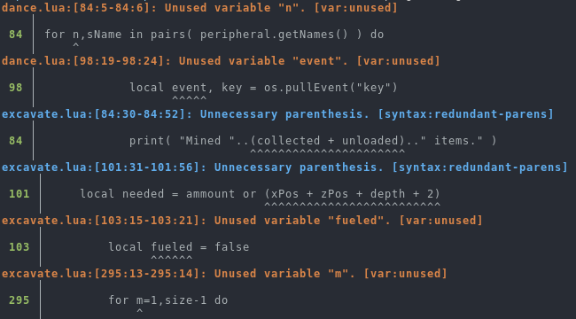
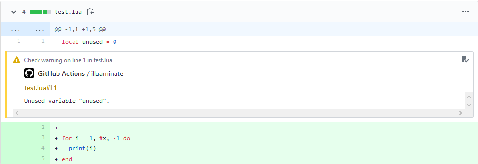
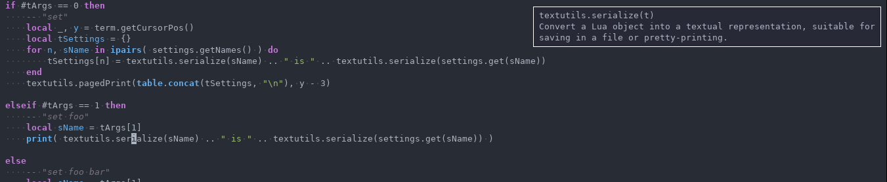
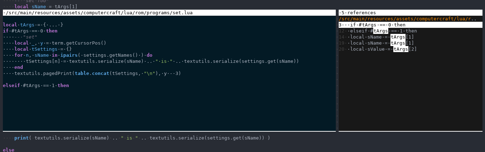
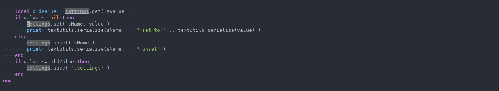
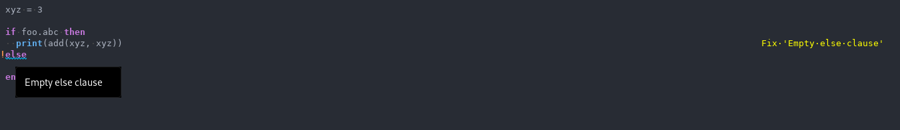

# 💡 Illuaminate
Source code analysis for Lua

Illuaminate is a series of tools for working with Lua source code, providing
ways of making your codebase clearer and easier to understand. It's currently
rather bare bones, and still at a POC stage, but hopefully will expand and
become more useful as it continues to develop.

<p align="center">

</p>

## Features
 - Many basic static analysis features (dead code detection, unused variables,
   etc...) as well as several formatting linters (whitespace, redundant
   parenthesis, etc...).
 - Automatic code fixer for many of the detected problems.
 - Documentation generation, using LDoc syntax.
 - Integration with GitHub Actions

## Building

**Note:** use the [upx][] executable packer in order to make the compiled
files a reasonable size (it reduces them by 4x). It should be included in most
package managers.

### Using Opam
 - Install [opam][] and set up a OCaml 4.08.1 switch (`opam switch create
   4.08.1`). Later versions may work, but haven't been tested.
 - Insall [omnomnom][] using `opam pin add omnomnom https://github.com/SquidDev/omnomnom.git`.
 - Install all other dependencies: `opam install --deps-only ./illuaminate.opam`
 - Build using Dune: `dune build @install @runtest`
 - You may either install illuaminate into opam using `dune install`, or use the
   files in the `_build/install/default/bin` directory.

### Using Esy
 - Install [esy][]
 - Run `esy` in the repository's root.
 - Illuaminate can now be run using `esy x illuaminate`

## Usage
 - Either build Illuaminate as above, or download a pre-built version:
   ```
   > wget https://squiddev.cc/illuaminate/linux-x86-64/illuaminate # A x86-64 Linux static binary
   > wget https://squiddev.cc/illuaminate/windows-x86-64/illuaminate.js # A x86-64 Windows binary
   > wget https://squiddev.cc/illuaminate/linux-x86-64/illuaminate.js # JavaScript file which can be run with Node
   ```

   You may need to `chmod +x` the downloaded file to make it executable.

 - Run `illuaminate lint` to lint the current directory, or `illuaminate lint
   my/sub/directory` to lint a specific file or folder. You should receive a report of
   all problems detected.

 - Use `illuaminate fix` (or `illuaminate fix my/sub/directory`) to attempt to
   fix any detected problems. This command modifies the file in place, so it's a
   good idea to check your files into version control before fixing, and make
   sure you're happy with the changes made.

 - You can get more fine-grained control over illuaminate using its
   configuration files. `illuamiante init-config illuaminate.sexp` will generate
   a template config file which can be adjusted to suit your needs.

### GitHub actions
While illuaminate can be used from any CI system, we have somewhat extended
support for GitHub actions. Running `illuaminate lint --github` will upload any
warnings as annotations, allowing them to be viewed within the GitHub
interfaces:

<p align="center">

</p>

This can be done by adding the following to your workflow file:

```yml
# name, on, etc...

jobs:
  build:
    runs-on: ubuntu-latest

    steps:
      # ...
    - name: Lint Lua code
      run: |
        # Download illuaminate
        test -d bin || mkdir bin
        test -f bin/illuaminate || wget -q -Obin/illuaminate https://squiddev.cc/illuaminate/bin/illuaminate
        chmod +x bin/illuaminate
        # And run it
        GITHUB_TOKEN=${{ secrets.GITHUB_TOKEN }} bin/illuaminate lint --github
```

## Language server
Illuaminate has support for the [language server protocol][lsp]. This allows it
to be used with [many different editors and tools][lsp_editors].

We provide [plugins for Emacs and VS Code][editor_tree]. Currently one must
build-from source, or copy into your own setup as we do not currently publish
them on the package repositories - this will change as illuaminate matures.

The server can be downloaded as with [normal illuaminate][#usage] - just change
the executable to `illuaminate-lsp`.

The language server has support for the following features:

### Documentation
Illuaminate parses documentation comments, and uses them to display information
about modules and functions.

<p align="center">

</p>

### Find all references and go to definition
One may find all references of local variables, and jump to the definition of
any local or module variable.

<p align="center">

</p>
<p align="center">

</p>

### Diagnostics and code fixes
Any error or warning message that `illuaminate lint` reports is also shown in
your editor. For any warning which has an automatic fix, we provide a code
action to apply it.

<p align="center">

</p>


[opam]: https://opam.ocaml.org/doc/Install.html
[omnomnom]: https://github.com/SquidDev/omnomnom
[actions]: https://github.com/features/actions
[esy]: https://esy.sh/
[lsp]: https://microsoft.github.io/language-server-protocol
[lsp_editors]: https://microsoft.github.io/language-server-protocol/implementors/tools
[editor_tree]: https://github.com/SquidDev/illuaminate/tree/master/src/editor
